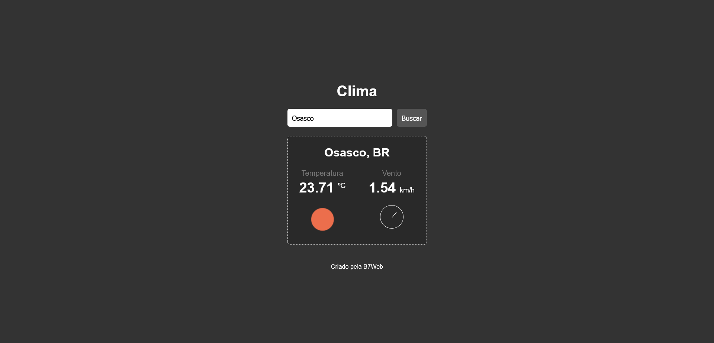

# Simple weather consult using JavaScript, created by B7Web

## Overview

### Screenshot

### Links

-   Solution URL: https://viniciusdsv93.github.io/Weather-location/

## My process

### Built with

-   Semantic HTML5 markup
-   CSS custom properties
-   JavaScript

### What I learned

In this project i could use an external API to provide information about weather on a specific location entered by the user.

## Author

-   GitHub - Vinícius dos Santos Verissimo (https://github.com/viniciusdsv93)
